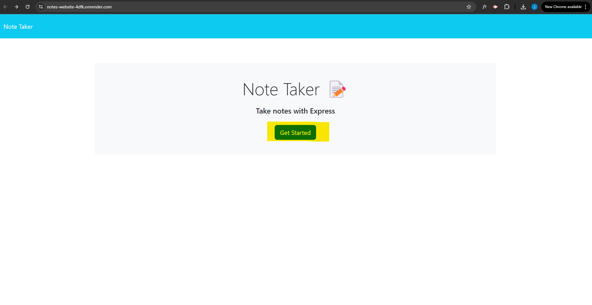
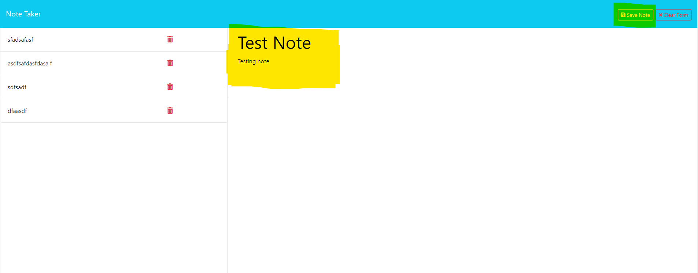
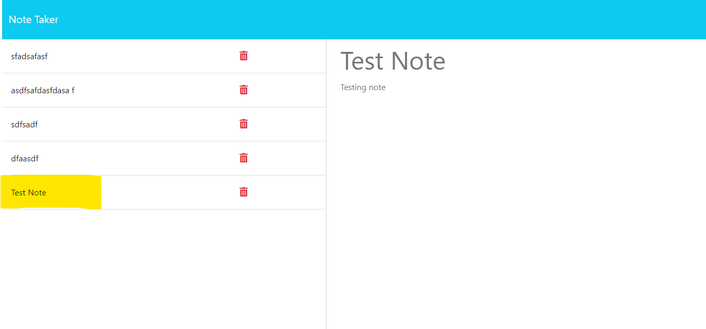
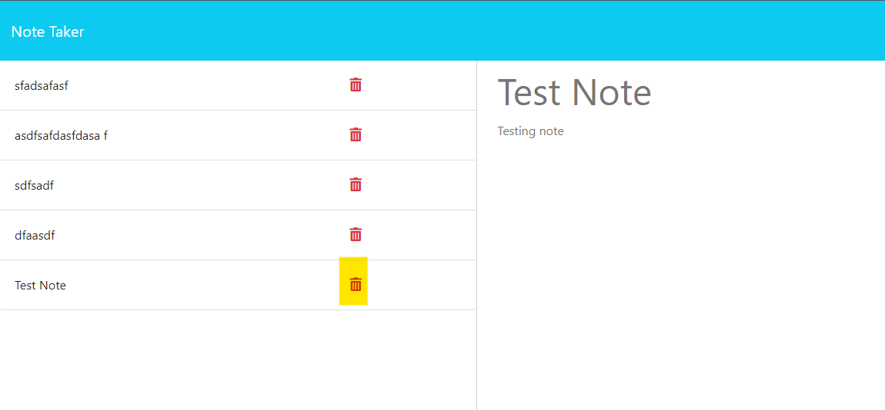

  # Notes Website
  

## Description
  
My goal for this application was to create a a notes website using a node based express server to handle requests.  

## Installation
  
This application is deployed on Render.com.  You can visit the link below to use the website.

[Link to deployed Site](https://notes-website-4dfk.onrender.com/)
  
## Usage

Follow the link above.  Once on the site select get started. 

You will be brought to a web page with existing notes on the left and a blank note on the right.  Fill out the blank note title, and body and select save note in the top right corner.  This will create a new note saved in the JSON database for this project.  

You can view the new note by clicking on it in the left pane.

You can delete notes by clicking on the trash can on the right hand side of each note.  This will delete the note from the JSON database.

## Credits

Technology used

[Nodejs](https://nodejs.org/en)\
[Express](https://expressjs.com/)\
[Render](https://render.com/)\
[Generate Unique ID](https://www.npmjs.com/package/generate-unique-id)

## Questions

If you have any questions please contact me below.

[Github](https://github.com/jakerasmusson)

